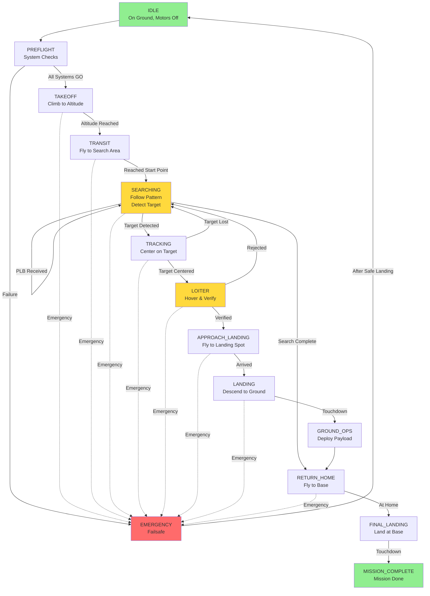

# SAR Mission State Machine Design

## Overview
This document explains the state machine design for your SAR drone mission, following best practices and the project requirements.

## Design Principles

### ✅ What Makes a GOOD State?
1. **Single Purpose** - Each state does ONE clear thing
2. **Clear Entry Condition** - Know exactly when to enter
3. **Clear Exit Condition** - Know exactly when to leave
4. **Actionable** - Maps to real drone commands
5. **Observable** - Can test/verify in simulation and reality
6. **Atomic** - Can't be broken down further without losing meaning

### ❌ What Makes a BAD State?
1. **Too granular** - "IncrementAltitudeBy1Meter" (too specific)
2. **Too vague** - "Flying" (what kind of flying?)
3. **Just a flag** - "TargetDetected" (event, not state)
4. **Transition** - "TransitioningFromAtoB" (not a stable state)
5. **Calculation** - "CalculatingPath" (instant, not a state)

---

## Final State List (14 States)

### 1. Ground Operations
- **IDLE** - Power on, waiting for mission start
- **PREFLIGHT** - System checks, GPS lock, sensor calibration

### 2. Flight Operations
- **TAKEOFF** - Vertical climb to mission altitude
- **TRANSIT** - Fast horizontal flight to search area

### 3. Search Operations
- **SEARCHING** - Following search pattern, detecting targets
  - Uses `SearchMode` flag: BROAD (initial) or FOCUSED (post-PLB)
  - PLB doesn't create a new state, just changes search behavior

### 4. Target Engagement
- **TRACKING** - Actively following detected target, centering
- **LOITER** - Hovering over target for verification

### 5. Landing Sequence
- **APPROACH_LANDING** - Flying to calculated safe landing spot (5-10m from target)
- **LANDING** - Vertical descent to ground
- **GROUND_OPS** - On ground, deploying first aid kit

### 6. Return Home
- **RETURN_HOME** - Flying back to takeoff location
- **FINAL_LANDING** - Landing at home base

### 7. Terminal States
- **MISSION_COMPLETE** - Successful completion, motors off
- **EMERGENCY** - Failsafe state, can trigger from any state

---

## Key Design Decisions

### Decision 1: Single SEARCHING State (Not Two)
**Question:** Should we have SEARCH_BROAD and SEARCH_FOCUSED as separate states?

**Decision:** Single SEARCHING state with a `search_mode` flag

**Rationale:**
- Same behavior (follow waypoints, detect)
- Only difference is waypoint list changes
- PLB is an EVENT, not a STATE
- Simpler state machine
- In code: `if search_mode == SearchMode.FOCUSED: use_plb_waypoints()`

### Decision 2: Keep TRACKING and LOITER Separate
**Question:** Should target verification be one state or two?

**Decision:** Keep separate

**Rationale:**
- TRACKING = dynamic movement (centering, following)
- LOITER = stationary hovering (verification, confirmation)
- Different failure modes (lose track vs. reject target)
- Different pilot actions required
- In real world: TRACKING uses position control, LOITER uses loiter mode

### Decision 3: Keep PREFLIGHT Separate from IDLE
**Question:** Can we combine startup states?

**Decision:** Keep separate

**Rationale:**
- IDLE = motors can't spin, safe to approach
- PREFLIGHT = motors may spin for testing, dangerous
- Different abort consequences (IDLE = no risk, PREFLIGHT = may need emergency land)
- Clear mission start point

### Decision 4: APPROACH_LANDING Includes Calculation
**Question:** Should "calculating landing spot" be its own state?

**Decision:** No, it's part of APPROACH_LANDING

**Rationale:**
- Calculation is instant (milliseconds)
- States should last >= 1 second typically
- Landing spot calculation is just part of approaching
- In code: Calculate on entry to APPROACH_LANDING state

### Decision 5: Separate LANDING and GROUND_OPS
**Question:** Can landing and payload deployment be one state?

**Decision:** Keep separate

**Rationale:**
- Need to confirm touchdown before deploying payload
- Safety: Don't drop payload while descending
- Different sensors (altimeter vs. ground contact switch)
- Could abort landing without deploying

### Decision 6: RETURN_HOME vs. FINAL_LANDING
**Question:** Is landing at home different from landing in field?

**Decision:** Keep separate states

**Rationale:**
- RETURN_HOME = horizontal flight + climb
- FINAL_LANDING = vertical descent only
- Different precision requirements (home has landing pad)
- Home landing might have different abort procedures

---

## State Transition Rules

### Primary Path (No Target Found)
```
IDLE → PREFLIGHT → TAKEOFF → TRANSIT → SEARCHING → RETURN_HOME → FINAL_LANDING → MISSION_COMPLETE
```

### Success Path (Target Found & Delivered)
```
IDLE → PREFLIGHT → TAKEOFF → TRANSIT → SEARCHING →
  [PLB received: switch to focused search] →
  TRACKING → LOITER → APPROACH_LANDING → LANDING → GROUND_OPS →
  RETURN_HOME → FINAL_LANDING → MISSION_COMPLETE
```

### Error Recovery
```
ANY_STATE → EMERGENCY → [RTH or Emergency Land] → IDLE
```

---

## Emergency Conditions

Can trigger from ANY state:
- Low battery (< 20%)
- GPS lost (no fix for > 5 seconds)
- Communication lost (no heartbeat > 3 seconds)
- No-fly zone violation
- Manual abort command
- Sensor failure (camera, altimeter, etc.)

**Emergency Action:**
1. Stop current mission
2. IF altitude > 10m AND GPS good: RTH
3. ELSE: Emergency land at current location
4. After safe landing: Transition to IDLE for recovery

---

## Mapping to Project Requirements

| Requirement | States Involved |
|-------------|-----------------|
| R01: Stay in Flight Area | All flight states check geofence |
| R02: Don't fly over SSSI | TRANSIT, SEARCHING check no-fly zones |
| R03: Takeoff from TOL | TAKEOFF (starts at TOL) |
| R04: Max altitude 50m | All flight states enforce |
| R05: Search and identify | SEARCHING, TRACKING, LOITER |
| R06: PLB focus | SEARCHING (mode change) |
| R07: Land 5-10m away | APPROACH_LANDING, LANDING |
| R08: RTH and failsafes | EMERGENCY state |
| R09: Report detections | TRACKING, LOITER log data |
| R10: Pilot supervision | All states report to GCS |

---

## Visualization

### Copy this to https://mermaid.live for flowchart:



---

## Implementation Notes

### State Variables Needed
```python
class MissionContext:
    # Current state
    current_state: MissionState

    # Search mode (for SEARCHING state)
    search_mode: SearchMode  # BROAD or FOCUSED

    # Waypoint tracking
    current_waypoint: int
    waypoint_list: List[Waypoint]

    # Target tracking
    target_detected: bool
    target_position: (float, float)
    target_confidence: float

    # PLB data
    plb_received: bool
    plb_focus_area: Polygon

    # Landing data
    landing_spot: (float, float)

    # Emergency
    emergency_type: EmergencyType
```

### Typical Time in Each State
- IDLE: Until mission start
- PREFLIGHT: 5-10 seconds
- TAKEOFF: 10-15 seconds (climbing to 30m)
- TRANSIT: 20-60 seconds (depending on distance)
- SEARCHING: 2-10 minutes (until target found or complete)
- TRACKING: 5-20 seconds (centering on target)
- LOITER: 10-30 seconds (verification)
- APPROACH_LANDING: 5-15 seconds
- LANDING: 10-20 seconds (slow descent)
- GROUND_OPS: 2-5 seconds (payload drop)
- RETURN_HOME: 20-60 seconds
- FINAL_LANDING: 10-20 seconds
- MISSION_COMPLETE: Terminal

**Total Mission Time:** 5-15 minutes typical

---

## Benefits of This Design

1. ✅ **Clear** - Each state has obvious purpose
2. ✅ **Flowchartable** - Easy to visualize and explain
3. ✅ **Testable** - Can verify each state independently
4. ✅ **Debuggable** - Know exactly where drone is in mission
5. ✅ **Maintainable** - Easy to add/modify states
6. ✅ **Real-world Ready** - Maps to actual drone operations
7. ✅ **Safety First** - EMERGENCY accessible from anywhere
8. ✅ **Complete** - Covers all project requirements

---

## Next Steps

1. ✅ Run `python sar_states.py` to see state summary
2. ✅ Copy Mermaid flowchart to https://mermaid.live
3. ⬜ Update `simple_simulator.py` to use new states
4. ⬜ Test in simulation
5. ⬜ Create detailed transition logic for each state
6. ⬜ Implement in Mission Planner
7. ⬜ Test on real hardware
