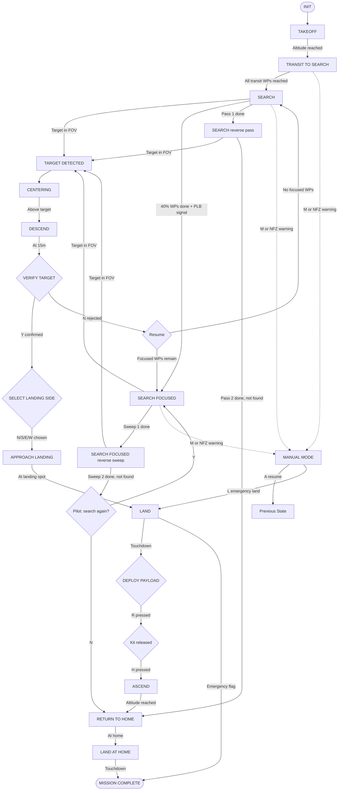

```mermaid
  graph TD
      INIT([INIT]) --> TAKEOFF[TAKEOFF]
      TAKEOFF -->|Altitude reached| TRANSIT_TO_SEARCH[TRANSIT TO SEARCH]
      TRANSIT_TO_SEARCH -->|All transit WPs reached| SEARCH[SEARCH]

      SEARCH -->|Target in FOV| TARGET_DETECTED[TARGET DETECTED]
      SEARCH -->|40% WPs done + PLB signal| SEARCH_FOCUSED[SEARCH FOCUSED]
      SEARCH -->|Pass 1 done| SEARCH_REV[SEARCH reverse pass]
      SEARCH_REV -->|Target in FOV| TARGET_DETECTED
      SEARCH_REV -->|Pass 2 done, not found| RETURN_TO_HOME

      SEARCH_FOCUSED -->|Target in FOV| TARGET_DETECTED
      SEARCH_FOCUSED -->|Sweep 1 done| FOCUSED_REV[SEARCH FOCUSED reverse sweep]
      FOCUSED_REV -->|Target in FOV| TARGET_DETECTED
      FOCUSED_REV -->|Sweep 2 done, not found| PILOT_RETRY{Pilot: search again?}
      PILOT_RETRY -->|Y| SEARCH_FOCUSED
      PILOT_RETRY -->|N| RETURN_TO_HOME

      TARGET_DETECTED --> CENTERING[CENTERING]
      CENTERING -->|Above target| DESCEND[DESCEND]
      DESCEND -->|At 15m| VERIFY_TARGET{VERIFY TARGET}
      VERIFY_TARGET -->|Y confirmed| SELECT_LANDING_SIDE{SELECT LANDING SIDE}
      VERIFY_TARGET -->|N rejected| RESUME{Resume}
      RESUME -->|Focused WPs remain| SEARCH_FOCUSED
      RESUME -->|No focused WPs| SEARCH

      SELECT_LANDING_SIDE -->|N/S/E/W chosen| APPROACH_LANDING[APPROACH LANDING]
      APPROACH_LANDING -->|At landing spot| LAND[LAND]
      LAND -->|Touchdown| DEPLOY_PAYLOAD{DEPLOY PAYLOAD}
      LAND -->|Emergency flag| MISSION_COMPLETE([MISSION COMPLETE])
      DEPLOY_PAYLOAD -->|R pressed| DEPLOY_H{Kit released}
      DEPLOY_H -->|H pressed| ASCEND[ASCEND]

      ASCEND -->|Altitude reached| RETURN_TO_HOME[RETURN TO HOME]
      RETURN_TO_HOME -->|At home| LAND_AT_HOME[LAND AT HOME]
      LAND_AT_HOME -->|Touchdown| MISSION_COMPLETE

      MANUAL[MANUAL MODE] -->|A resume| PREVIOUS[Previous State]
      MANUAL -->|L emergency land| LAND

      SEARCH -.->|M or NFZ warning| MANUAL
      SEARCH_FOCUSED -.->|M or NFZ warning| MANUAL
      TRANSIT_TO_SEARCH -.->|M or NFZ warning| MANUAL
```
