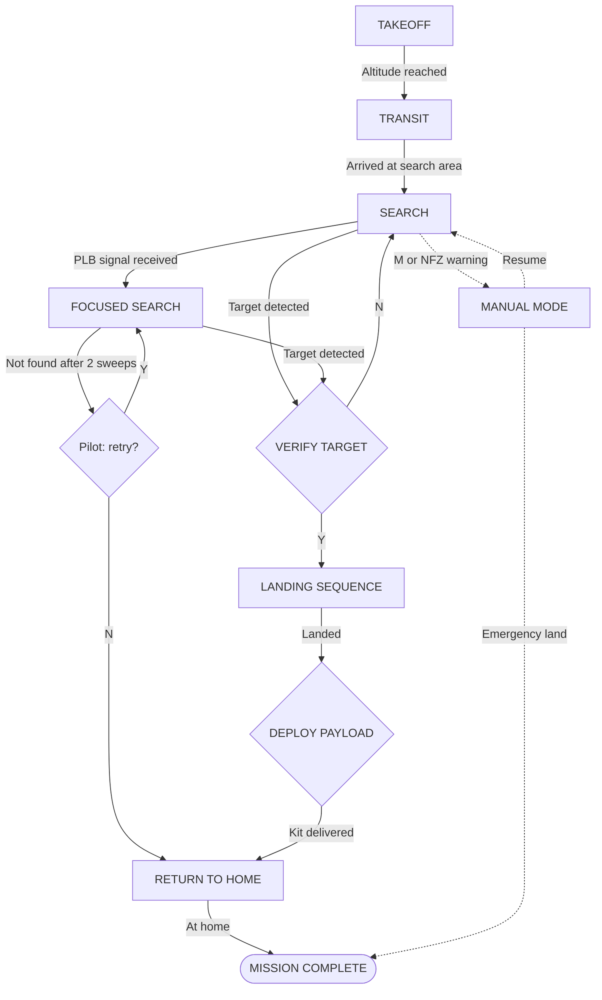

```mermaid
graph TD
    TAKEOFF[TAKEOFF] -->|Altitude reached| TRANSIT[TRANSIT]
    TRANSIT -->|Arrived at search area| SEARCH[SEARCH]

    SEARCH -->|PLB signal received| FOCUSED[FOCUSED SEARCH]
    SEARCH -->|Target detected| VERIFY
    FOCUSED -->|Target detected| VERIFY
    FOCUSED -->|Not found after 2 sweeps| PILOT{Pilot: retry?}
    PILOT -->|Y| FOCUSED
    PILOT -->|N| RTH

    VERIFY{VERIFY TARGET} -->|Y| LANDING[LANDING SEQUENCE]
    VERIFY -->|N| SEARCH

    LANDING -->|Landed| DEPLOY{DEPLOY PAYLOAD}
    DEPLOY -->|Kit delivered| RTH[RETURN TO HOME]
    RTH -->|At home| COMPLETE([MISSION COMPLETE])

    MANUAL[MANUAL MODE] -.->|Resume| SEARCH
    MANUAL -.->|Emergency land| COMPLETE
    SEARCH -.->|M or NFZ warning| MANUAL
```
